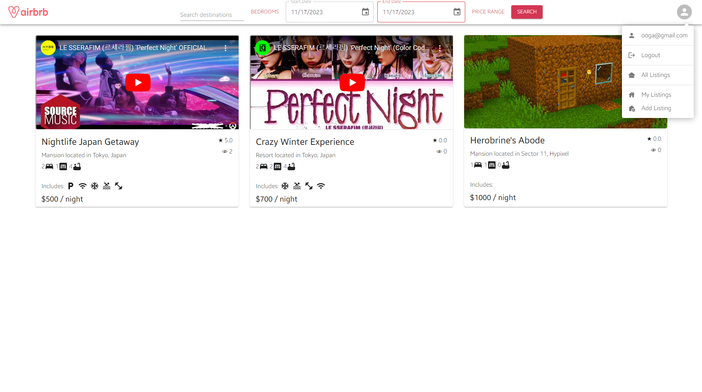

# ACCESSIBILITY

As growing web developers we have tried to incorporate accessibility feature and considerations throughout the website.

## 1. ALT TAGS

The utilisation of alt tags whenever there is an image was used to ensure that in the case that the user were to be blind, they would be able to use the text to get an audible indication of what was on the screen. In addition, if the user's connection was poor, and the image failed to load, then this would help give the user context about what the user and the page is about. 2.

## 2. COLOUR PALETTE

The utilisation of good colours with ample colour contrast was utilised throughout the entirety of the website. This ensures that the page remains easy to read, especially for those who may be colour blind. As the colours are distinct, making them easy to read and tell apart from each other in addition not being harmful to the user if they were to view the page for an extended period of time.

## 3. NAVIGATIONAL ACCESSIBILITY

A major part of our website was to focus of providing an easy to navigate experience. This was achieved through the use of providing multiple methods of reaching a certain page, or completing a certain action. An example of this are the buttons used to reach the add listings page.

Here is an example:

Take note of the drop user down menu.

And here, take note of the plus button on the bottom right.

Both reaches the same destination, however, being able to give the user that freedom and fluidity increases it's ergonomic quality.

## 4. KEYBOARD SHORTCUTS

A web application like this has several forms that may need to be filled out constantly (depending on the user...), hence, the implementation of shortcuts within the forms provides keyboard accessiblity.

Not only does this provide users with the ability to complete forms faster if desired, but it also ensures that individuals who have difficult using mouse cursors have more accessible options to complete a task.

## 5. TEXT SIZE

The text size of the page of a readable size. We have tried to avoid using small font sizes and even thing font family styles if necessary. This is due to its potential to limit the user's ability to read the contents of the page without struggle.
