# UI/UX

## FIGMA MOCK UPS

For this assignment, we had utilised Figma to create a quick demo of what we would like our page to look like.

During this time, we took many aspects into consideration. These aspects included: color, shape, size, alignment, fonts and consistency.

We drew a lot of inspiration from the Airbnb website itself.

Here are some examples of our Figma mock up:

### FIGMA EXAMPLES

| EXAMPLES            | IMAGES                                        |
| ------------------- | --------------------------------------------- |
| Overview            | 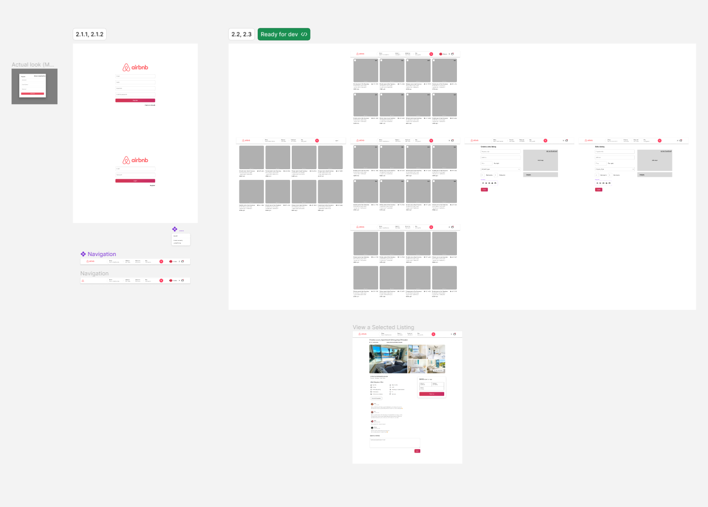            |
| Register Screen     | 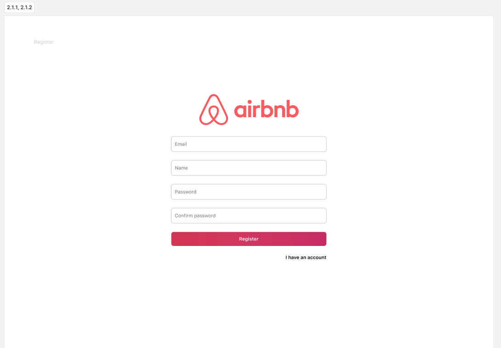     |
| Listings Page       | 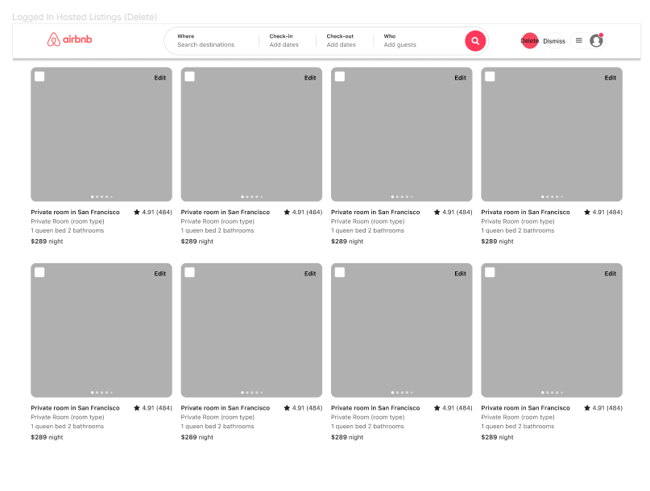       |
| Create Listing Page | 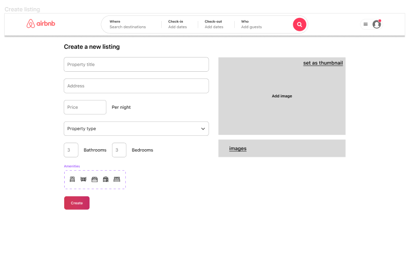 |
| Listing Page        | 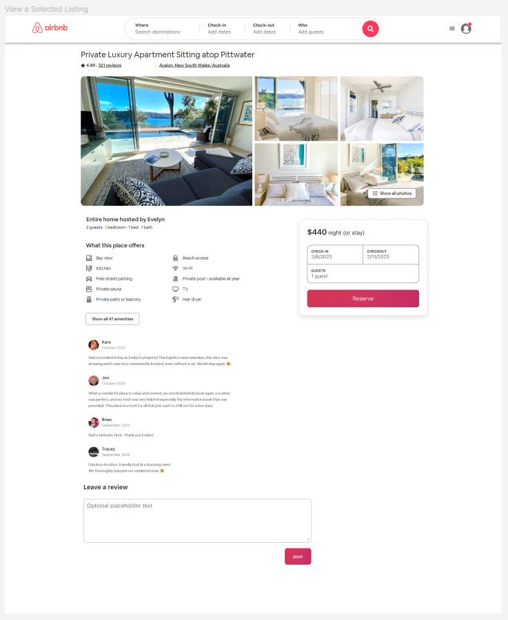        |

We found that this was extremely helpful in guiding us through the process of developing the interface. It provided a way to experiment with components we had in mind and also arrange them the way we wanted.

The struggle of finnicking with styling was minimised.

## SIZE

Sizing of components was important as we wanted our users to be drawn into the more important features, such as the listings themselves and thus, the images for each card were large, obvious and hopefully bright - that would be up to the user's decision for a thumbnail aha

When it comes to optional features, we wanted the users to know and understand that those features were accessiblity and present, so those components were intentionally made smaller. This drew less attention, however, if the user needed to, for example, create a listing, they could very much do so.

Text sizing was kept to the standard 3. One for headers, subtitles and for body text. This ensured that the page did not look messy with multiple font sizes.

Instead, the page was structured, and it was clear which information was more important than others.

In the chance that a header needed to be **EVEN MORE** important, we would use a thicker font.

## COLOUR + CONTRAST

For this assignment, the main colours were white and a reddish pink. This ensured that the website stayed simple and consistent. As a result, the pinkish red (which one is it? 👀) allowed us to apply accentutation on important components. For example, submit buttons on forms or menu button icons overlaying other components.

Additionally, contrast from the colours was great in making the page pop, and again, making certain components and features more important than others.

Another note to mention was that providing some components with shadows, creates a level of elevation over other components, which hopefully draws the user's attention to those components.

### EXAMPLES OF COLOUR AND CONTRAST

| EXAMPLES                  | IMAGES                                              |
| ------------------------- | --------------------------------------------------- |
| Bright Thumbnails         | 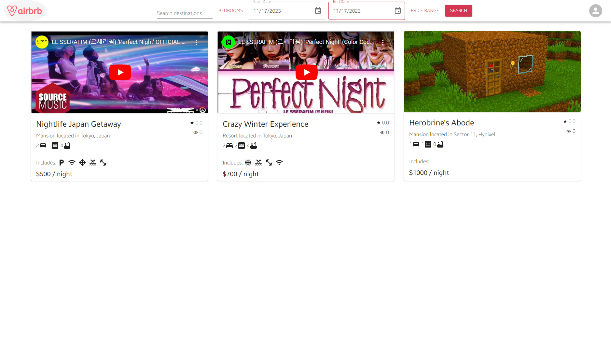          |
| Good Colour Palette       | 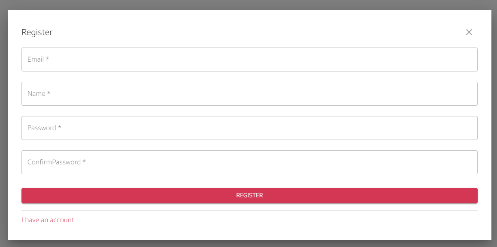        |
| Elevation Of Booking Form | 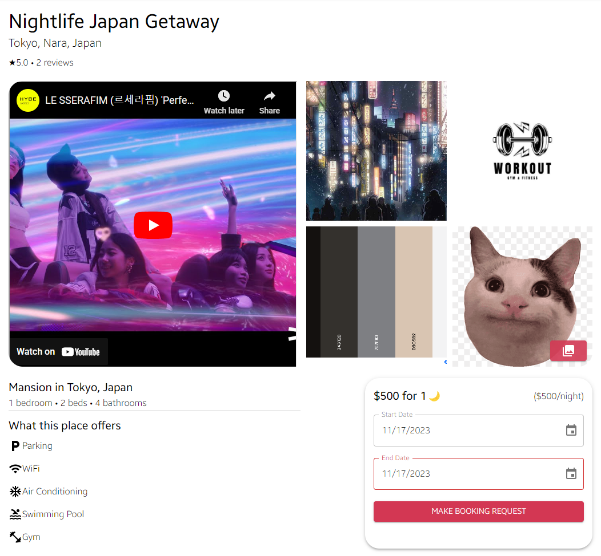 |

## SPACING + ALIGNMENT

Throughout the design of this website, we made sure to as best eye candy 🍭 as we could, and a lot of this was derived from the spacing and alignment of components on the screen.

For starters, the content of the page was intentionally squished vertically as it would prevent the user from needing to dart their eyes from one side of the screen to the other.

This provided us a great way to provide some alignments with the multiple components on screen.

A great example of this would be the alignment of the cards wherever they are listed.

The spacing in between them is also made consistent, and remains even when the window is resized.

### EXAMPLES OF SPACE + ALIGNMENT

| EXAMPLES           | IMAGES                                      |
| ------------------ | ------------------------------------------- |
| Booking Management | 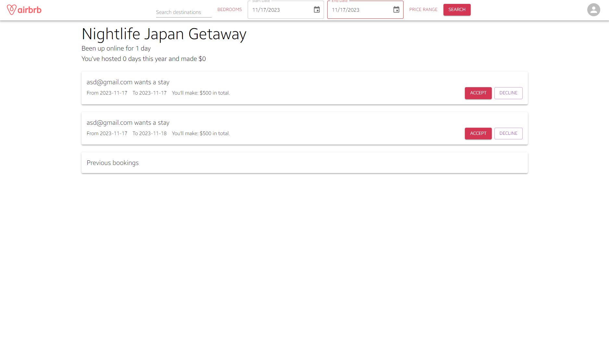 |
| Advanced Ratings   | 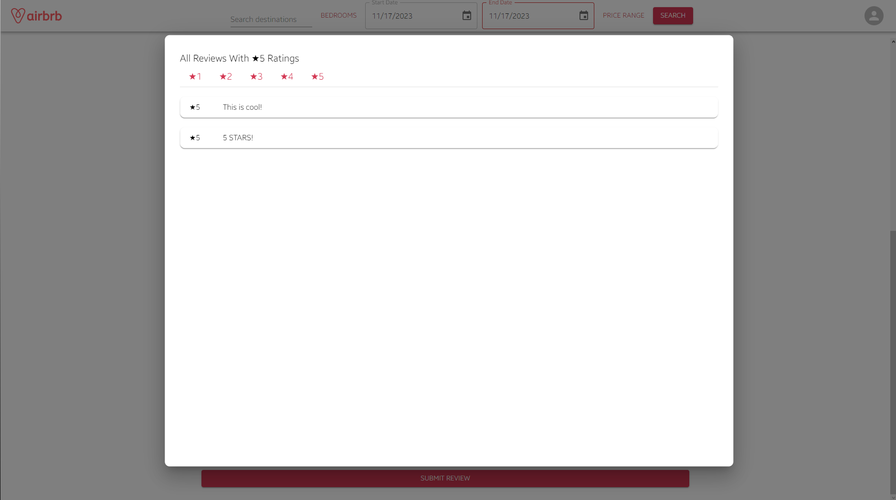   |
| Listings           | 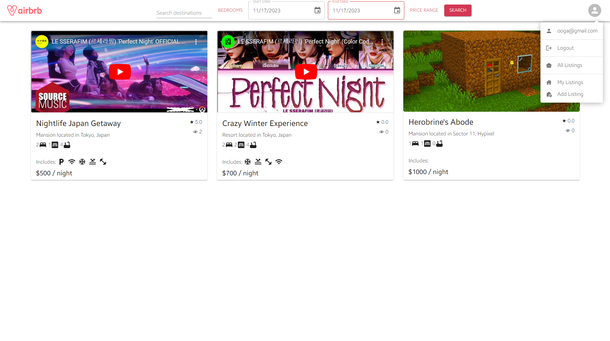           |
| Review Messages    | 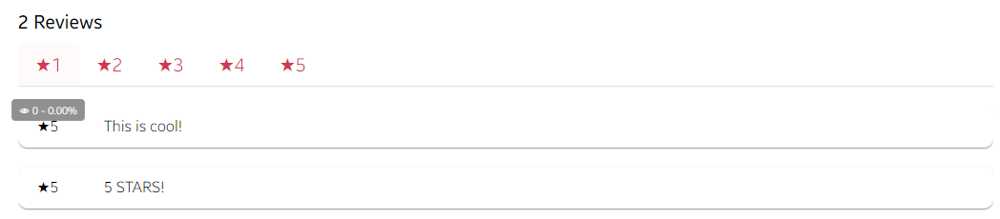   |
|                    |                                             |
|                    |                                             |

## REPTITION

Repetition is often used to make components appear to be on the same level and importance.

Great examples of this within the website would be the cards, review messages and booking tickets.

The repetion of these components next to each other made them feel more united through being displayed a packaged bundle.

### EXAMPLES OF REPETITION

| EXAMPLES                  | IMAGES                                             |
| ------------------------- | -------------------------------------------------- |
| Ratings + Reviews         |         |
| Booking Tickets + Reviews | 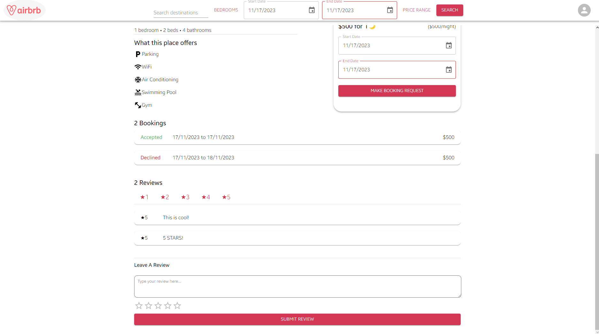 |
| Listings                  | 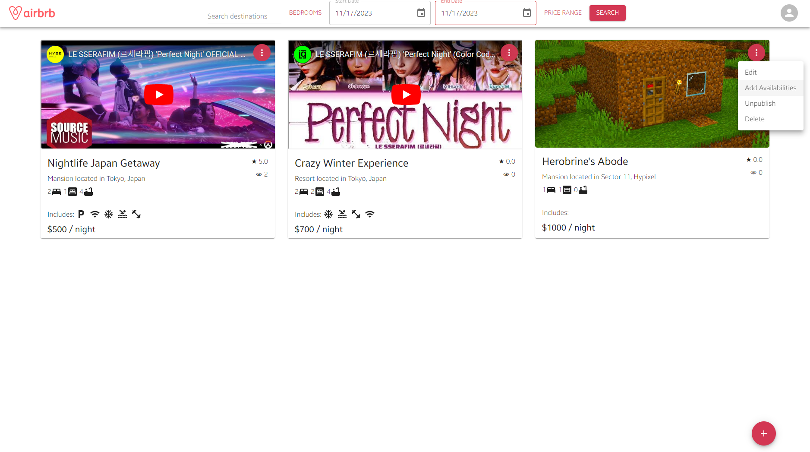                  |
